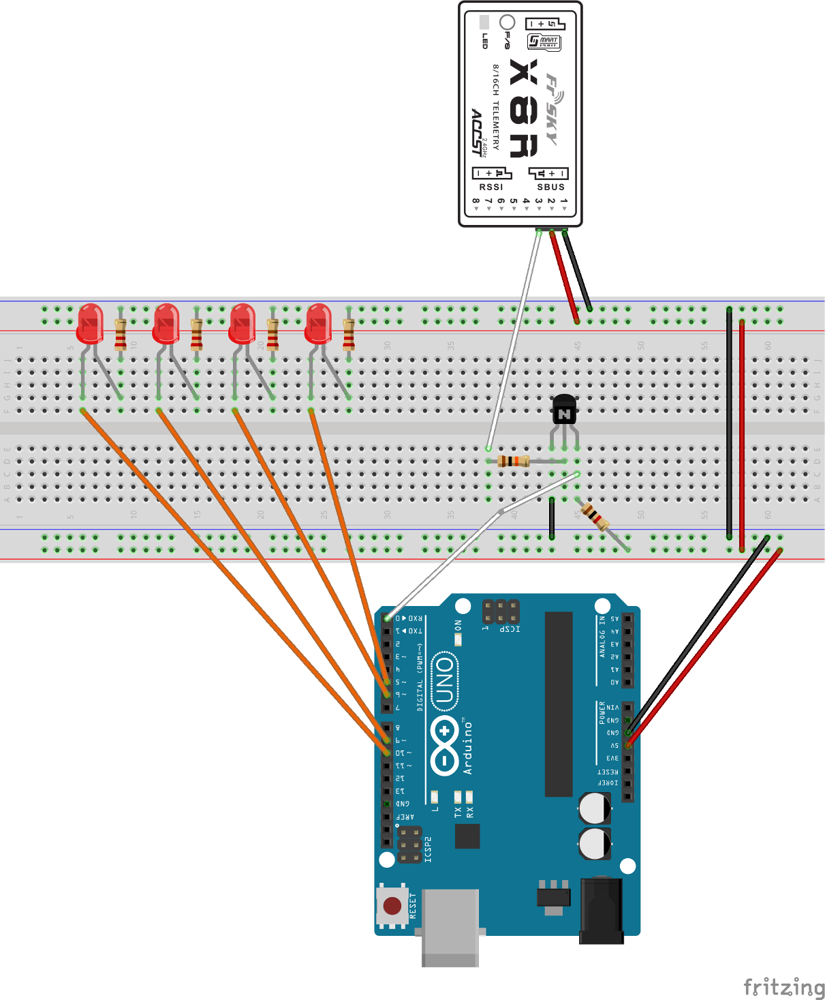
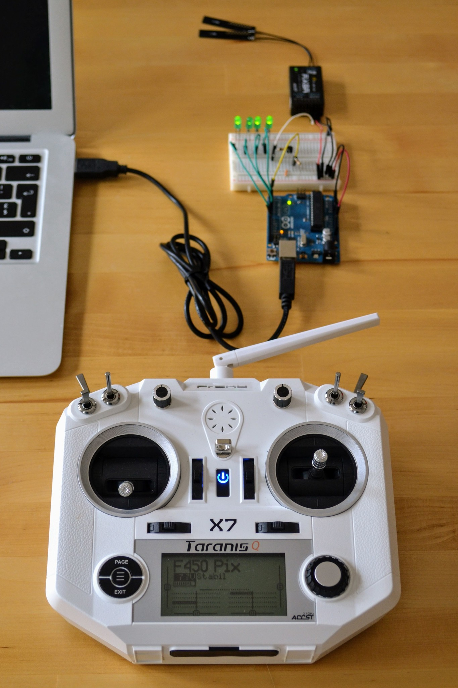
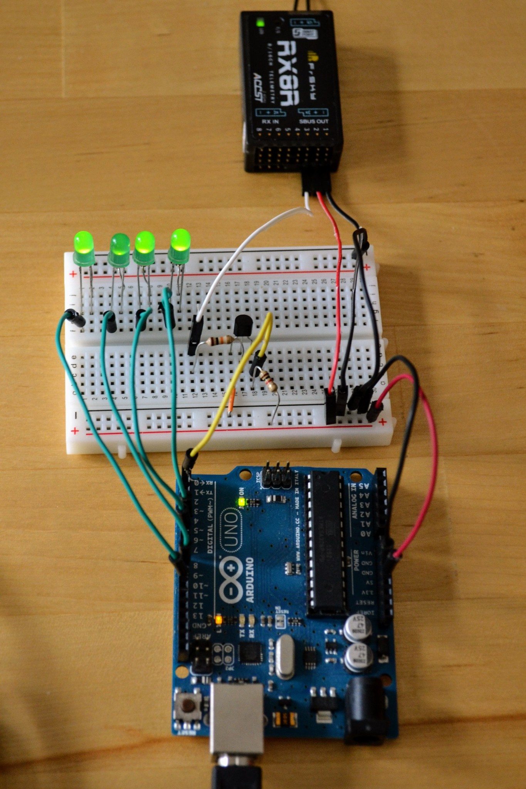

Note: for a variation using the Teensy 3.2 see the bottom of this page.

Arduino S.BUS
=============

I have an FrSKY [X8R receiver](http://www.frsky-rc.com/product/pro.php?pro_id=105) and I wanted to see the S.BUS channel values changing as I moved the sticks on my transmitter.

There are a number of Arduino libraries for decoding S.BUS output. I looked at all of them and chose the [zendes/SBUS](https://github.com/zendes/SBUS) one as it's short and simple and unlike some other libraries fully decodes the S.BUS flag byte (for details of the S.BUS protocol see the details [here](https://developer.mbed.org/users/Digixx/notebook/futaba-s-bus-controlled-by-mbed/)).

S.BUS is a serial protocol that operates at 100Kbps. Only the UNO's single hardware serial port can support this kind of speed ([SoftwareSerial](https://www.arduino.cc/en/Reference/softwareSerial) can only go up to 57.6Kbps and [AltSoftSerial](https://www.pjrc.com/teensy/td_libs_AltSoftSerial.html) can only go up to 31.25Kbps on the UNO).

The UNO's hardware serial port is tunnelled via USB to your computer and under normal circumstances is used for uploading sketches and for communicating, using `Serial.println(...)`, with the serial console of the Arduino IDE.

However in this setup `Serial`, i.e. our single hardware serial port, will be needed for receiving data from the receiver's S.BUS port. So it will not be possible to use `Serial.println(...)` to output information and when uploading sketches it will be necessary to temporarily unplug the wire connecting the Arduino RX pin to the circuit shown below.

Unfortunately the S.BUS output from the X8R is inverted so we need a simple inverter circuit (involving a NPN transistor and two resistors) so that the Arduino hardware serial can make sense of the signal. If we were using a software serial library it might be possible to do this inversion in code but, as explained earlier, this isn't an option here.

Instead of outputting information to the serial console the setup here uses four LEDs to indicate the current values of the first four S.BUS channels - these generally correspond to the four stick directions of your transmitter.

Hardware setup
--------------

For the inverter part of the circuit you'll need an NPN bipolar transistor with a standard EBC pinout (something like these [PN2222A](https://www.adafruit.com/product/756) transistors) and a 10K&Omega; and a 1K&Omega; resistor. For the LED part of the circuit you'll need four of the kind of hobbyist LEDs that are typically paired with 220&Omega; resistors (when used in 5V circuits) along with four such 220&Omega; resistors.

The circuit should be wired up as shown here.

The resistor going from the power rail of the breadboard to the row with the E pin of the transistor is the 1K&Omega; resistor while the one from the row with the B pin of the transistor (and on to the signal pin of the receiver) is the 10K&Omega; resistor. The resistors connected to the short legs of the LEDs are all 220&Omega;.

Note: in many inverter circuits you'll see noticeably different resistor values being used - the 10K&Omega; and 1K&Omega; values used here work fine but a large range of other values are also acceptable.

Software setup
--------------

Click [here](https://github.com/george-hawkins/arduino-sbus/archive/master.zip) to download this project from Github as a ZIP file.

Then, assuming you've got a recent version of the [Arduino IDE](https://www.arduino.cc/en/Main/Software), go to to the menu item  _Sketch_ / _Include Library_ / _Add .ZIP Library_ and select the ZIP file you just downloaded.

Then go to _File_ / _Examples_ - near the bottom of this menu you should now find _arduino-sbus-master_ and you can select _sbusleds_ from its submenu.

Now with this example sketch open plug in your UNO via USB and unplug the cable going into the RX pin of the UNO. Upload the sketch and once the upload is complete reconnect the cable to the RX pin. You'll need to repeat this process of disconnecting and reconnecting the RX pin everytime you want to upload a new version of the sketch. You don't need to remove power from the circuit when doing this.

If your transmitter is on then the green LED on the receiver should be on, indicating that it's connected to the transmitter. If you now move the sticks on your transmitter you should see the corresponding LEDs change in brightness accordingly.

Photos
------

 

Notes
-----

You can find the [Fritzing](http://fritzing.org/home/) file used to generate the breadboard picture above [here](arduino-sbus.fzz).

If, rather than an UNO, you used the popular [Teensy 3.2](https://www.pjrc.com/store/teensy32.html) (or the [Arduino MEGA 2560](https://www.arduino.cc/en/main/arduinoBoardMega2560)) you'd have more than one hardware serial port and so wouldn't have the issue seen here where the main hardware serial port is tied up communicating with the receiver. In such a setup you could attach the receiver to one of the secondary hardware serial ports and communicate as normal with the Arduino IDE serial console. So rather than using LEDs to output a limited amount of information you could dump out everything received via S.BUS - as is done in the original [BasicStatus sketch](https://github.com/zendes/SBUS/blob/master/examples/BasicStatus/BasicStatus.ino) that accompanies the original [zendes/SBUS](https://github.com/zendes/SBUS/) library (in this sketch the output of the receiver is assumed to be connected to the RX pin of `Serial3`).

The LEDs in the setup above are connected to pins 5, 6, 9 and 10 of the UNO. On the UNO only pins 3, 5, 6, 9, 10, and 11 support the `analogWrite(...)` function used here to vary the intensity of the LEDs (see the [`analogWrite(...)` reference](https://www.arduino.cc/en/Reference/analogWrite)). However pin 3 was not used here as the sketch also uses timer 2 which ties up pin 3 (although I'm not sure it really needs to). For more on timers and pins see [here](https://arduino-info.wikispaces.com/Timers-Arduino) and [here](https://playground.arduino.cc/Main/TimerPWMCheatsheet).

The [sbusleds sketch](examples/sbusleds/sbusleds.ino) provided here sets up timer 2 to invoke `sbus.process()` every millisecond to process the S.BUS input. This may give the false impression that you can choose what timer you want to use. This is not the case as the assumption that timer 2 will be used, if you're using timers, is hardcoded into `SBUS::begin(bool)` in [`SBUS.cpp`](SBUS.cpp). This implicit dependency should be made explicit or the code adjusted so any available timer can be used.

For more on inverter circuits and transistors see the [Sparkfun transistor tutorial](https://learn.sparkfun.com/tutorials/transistors/).

Licence
-------

Normally I use the Apache version 2 license but this project retains the [GPLv2 license](LICENSE) of the original [zendes/SBUS](https://github.com/zendes/SBUS) project.

Note: the [zendes/SBUS](https://github.com/zendes/SBUS) library is an Arduino port of the mbed [SBUS-Library_16channel](https://developer.mbed.org/users/Digixx/code/SBUS-Library_16channel/) library from Uwe Gartmann that has no clear license details.

Teensy 3.2
----------

As noted above one could avoid the complexity around having to use the only hardware serial port of the UNO to communicate with the receiver if using a board like the Teensy 3.2 that has multiple hardware serial ports.

Here is a circuit layout using the Teensy 3.2 where the receiver is connected to the RX pin of the second hardware serial port.

**Important:** I haven't built this circuit or tried it out so it may do nothing or explode for all I know.

The Teensy 3.2 is a 3.3V device while the X8R receiver requires a minimum input voltage of 4V. We can provide the receiver with 5V if we power the Teensy via USB and the connect the VIN pin to the breadboard (which should make available the 5V provided by USB).

The receiver operates at 100mA@5V. We can connect the circuit's 5V signal directly to the RX2 pin of the Teensy as all its digital input pins are 5V tolerant.

The Fritzing file for the above Teensy circuit can be found [here](teensy-sbus.fzz).

TODO: check that 5V tolerant works as expected when using a pin as a hardware serial pin.

TODO: confirm that the VIN pin provides the 5V delivered by USB.

TODO: just dumping S.BUS data to the console as is done in the  original [BasicStatus sketch](https://github.com/zendes/SBUS/blob/master/examples/BasicStatus/BasicStatus.ino) isn't very readable. Try something like the processing sketch described [here by ROBOTmaker](http://www.robotmaker.eu/ROBOTmaker/quadcopter-3d-proximity-sensing/sbus-graphical-representation). Note: the ROBOTmaker processing sketch seems to consume raw S.BUS packets directly on the main computer - it's unclear if the computer reads these directly via FTDI or if this happens via the UNO (in which case it'd have to be every nth packet as the UNO can't both read the signal at 100Kbps and forward it on).
